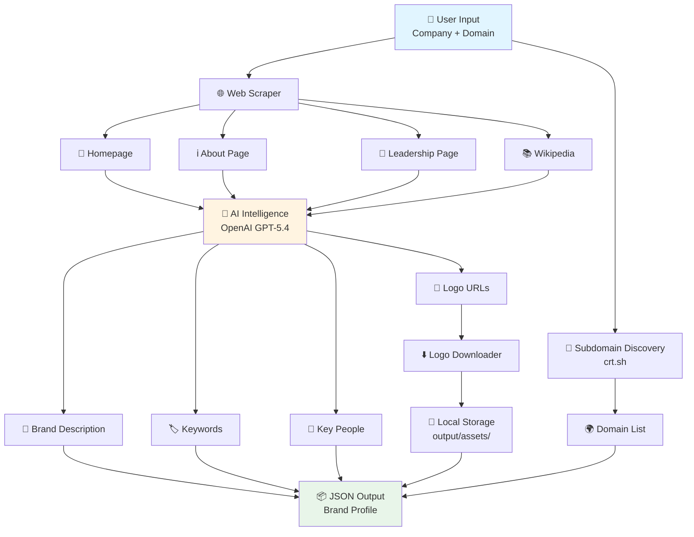

# 🛡️ Brand Intelligence Pipeline

An automated brand protection onboarding system that takes minimal input (company name + domain) and automatically discovers brand signals. Built to solve the problem of manual brand intelligence gathering described in [`problem.md`](problem.md).

## 📖 Overview

This pipeline automates the discovery and extraction of brand signals for brand protection services. Instead of manually researching companies, the system automatically:

- 🌐 Scrapes relevant web pages (homepage, about, leadership, Wikipedia)
- 🔍 Discovers subdomains via certificate transparency logs
- 🤖 Extracts brand signals using AI (description, keywords, key people, logos)
- 🖼️ Downloads and stores logo images
- 📄 Generates structured JSON output with all discovered information

### 🎯 Problem Solved

**Before:** Customers had to manually provide:
- Brand/product logos (images)
- List of owned domains
- Business keywords
- Names and faces of key people

**After:** Just provide company name + one domain, and the pipeline automatically discovers:
- ✅ Additional owned domains (via subdomain discovery)
- ✅ Brand logos (extracted and downloaded)
- ✅ Business keywords (AI-extracted from content)
- ✅ Key people and their roles (AI-extracted)

## 🏗️ Architecture



### 📂 Module Structure

- **`main.py`** - Entry point and orchestration of the pipeline
- **`pipeline/scraper.py`** - Web scraping functionality with BeautifulSoup
- **`pipeline/discovery.py`** - Subdomain discovery via crt.sh certificate transparency
- **`pipeline/intelligence.py`** - OpenAI-powered brand signal extraction
- **`pipeline/models.py`** - Pydantic data models for validation and structure

## ✨ Key Features

### 🌐 Automated Web Scraping
- Homepage content extraction
- About page analysis
- Leadership/team page discovery
- Wikipedia integration
- Respects rate limits (1-second delays)

### 🔍 Subdomain Discovery
- Certificate Transparency log analysis via crt.sh
- Discovers all domains owned by the company
- Helps identify the full digital footprint

### 🤖 AI-Powered Extraction
- **Company Description**: Concise brand summary
- **Keywords**: Business-relevant terms and product categories
- **Key People**: Names, roles, and descriptions of executives/founders
- **Logo Detection**: Identifies and ranks logo candidates

### 🖼️ Logo Management
- Automatic download of top logo candidates
- Local storage in `output/assets/`
- Structured metadata with file paths
- Multiple format support (PNG, JPG, SVG, etc.)

## 🛠️ Technology Stack

- **Python 3.8+** - Core language
- **BeautifulSoup4** - Web scraping and HTML parsing
- **OpenAI API** - LLM-based brand signal extraction (GPT-4)
- **Pydantic** - Data validation and modeling
- **Requests** - HTTP operations and web requests

## 🚀 Quick Start

See [`how_to_run.md`](how_to_run.md) for detailed setup and usage instructions.

**Basic usage:**
```bash
python main.py --company "Nike" --domain "nike.com"
```

**What you get:**
```
✅ Brand profile generated for Nike
   - Scraped 4 page(s)
   - Extracted brand signals (description, 15 keywords, 3 people, 2 logos)
   - Discovered 47 subdomain(s)
   - Downloaded 2 logo(s)
   - Output: output/brand_profile_nike_2026-03-22_19-30-45.json
```

## 📦 Output

The pipeline generates two types of output:

### 📄 JSON Profile
**Location:** `output/brand_profile_{company}_{timestamp}.json`

**Contains:**
- Company information and domain
- Discovered subdomains (full list)
- Scraped page content
- AI-extracted brand signals:
  - Company description
  - Business keywords
  - Key people (names, roles, descriptions)
  - Logo candidates with URLs and local paths
- Metadata and timestamps

### 🖼️ Logo Images
**Location:** `output/assets/`

**Format:** `{company}_logo_{index}_{timestamp}.{extension}`

Top 3 logo candidates automatically downloaded and referenced in the JSON output.

## 🎯 What Gets Automated

| Manual Task (Before) | Automated Solution (After) |
|---------------------|---------------------------|
| Provide domain list | Subdomain discovery via crt.sh |
| Upload logo images | AI detection + automatic download |
| List business keywords | AI extraction from web content |
| Identify key people | AI extraction from leadership pages |
| Write company description | AI-generated from scraped content |

## 📊 Example Output Structure

```json
{
  "company": "Nike",
  "domain": "nike.com",
  "infrastructure": {
    "subdomains": ["www.nike.com", "store.nike.com", "..."]
  },
  "brand_signals": {
    "description": "Global athletic footwear and apparel company...",
    "keywords": ["athletic footwear", "sportswear", "..."],
    "key_people": [
      {
        "name": "John Donahoe",
        "role": "CEO",
        "description": "President and CEO since 2020"
      }
    ],
    "logos": [
      {
        "url": "https://nike.com/logo.png",
        "local_path": "output/assets/nike_logo_0_2026-03-22_19-30-45.png",
        "confidence": "high"
      }
    ]
  }
}
```

## 🔮 Future Enhancements

- Social media profile discovery
- Product catalog extraction
- Brand color palette detection
- Competitor analysis
- Real-time monitoring integration
- Multi-language support