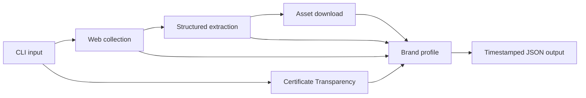

# Brand Intelligence Pipeline

Brand Intelligence Pipeline is a Python CLI for building structured brand profiles from a company name and a seed domain. It collects public web signals, discovers certificate-backed subdomains, extracts brand information with an LLM, and exports the result as validated JSON.

The project is designed as a foundation for brand monitoring, digital risk, trust and safety, and investigation workflows where analysts need a consistent first-pass view of an organisation's public footprint.

## Capabilities

- Collects content and image metadata from a company's homepage and common corporate pages.
- Enriches company context with public Wikipedia data when available.
- Discovers subdomains observed in Certificate Transparency logs through `crt.sh`.
- Extracts a company description, business keywords, key people, and logo candidates using structured LLM output.
- Downloads the highest-ranked logo candidates for local review.
- Validates and serialises the complete profile with Pydantic.
- Produces partial results when individual external sources are unavailable.

## Architecture



| Component | Responsibility |
|---|---|
| `main.py` | CLI, orchestration, asset download, and JSON output |
| `pipeline/scraper.py` | Website and Wikipedia collection |
| `pipeline/discovery.py` | Certificate Transparency subdomain discovery |
| `pipeline/intelligence.py` | LLM extraction with a strict JSON schema |
| `pipeline/models.py` | Typed domain model and output validation |

See [Architecture](docs/architecture.md) for design decisions and operational limitations.

## Quick start

Requirements:

- Python 3.10 or newer
- An OpenAI API key for brand-signal extraction

```bash
git clone https://github.com/SrLozano/brand-intelligence-pipeline.git
cd brand-intelligence-pipeline

python -m venv .venv
source .venv/bin/activate
pip install -r requirements.txt

export OPENAI_API_KEY="your-api-key"
python main.py --company "Nike" --domain "nike.com"
```

The collector and subdomain discovery can still run without an API key, but `brand_signals` will be empty.

## Configuration

| Variable | Default | Purpose |
|---|---|---|
| `OPENAI_API_KEY` | None | Enables LLM-based signal extraction |
| `OPENAI_MODEL` | `gpt-5.4-nano` | Selects the extraction model |
| `REQUEST_TIMEOUT` | `10` | Timeout in seconds for website and Wikipedia requests |
| `CRTSH_TIMEOUT` | `30` | Timeout in seconds for `crt.sh` requests |
| `USER_AGENT` | Browser-like default | Overrides the HTTP User-Agent header |

Environment variables may be exported by the shell or loaded from a local `.env` file. Secrets and generated output are excluded from version control.

## Output

Each run writes a timestamped profile to:

```text
output/brand_profile_{company}_{timestamp}.json
```

Downloaded assets are stored in `output/assets/`. A profile contains:

- the input company and domain;
- URLs successfully collected during the run;
- observed subdomains and their source;
- extracted description, keywords, people, and logo candidates;
- local paths for assets downloaded successfully;
- generation metadata.

The JSON schema is defined by the Pydantic models in `pipeline/models.py`.

## Data quality and scope

The output is discovery-oriented, not an authoritative ownership record. Certificate Transparency entries show that a hostname appeared on a certificate; they do not prove current control or ownership. LLM-extracted signals and downloaded assets should be reviewed before they drive enforcement or customer-facing decisions.

Network failures are isolated so that a run can return partial data. This favours availability, but production deployments should add structured logging, retries, observability, and explicit quality thresholds.

## Documentation

- [Product brief](docs/product-brief.md)
- [Architecture and design decisions](docs/architecture.md)
- [Operations guide](docs/operations.md)
- [Roadmap](docs/roadmap.md)

## Responsible use

Only collect publicly available information and respect applicable website terms, rate limits, privacy obligations, and local law. The pipeline is intended to support investigation and review, not to make automated claims of affiliation, ownership, infringement, or malicious intent.
